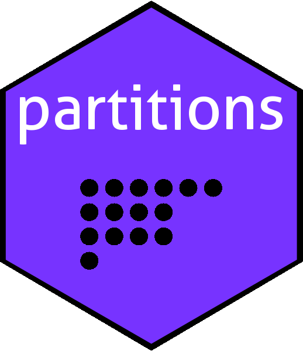

The partitions package: enumeration in R
================

<!-- README.md is generated from README.Rmd. Please edit that file -->

# 

<!-- badges: start -->

[](https://cran.r-project.org/package=partitions)
[](https://cran.r-project.org/package=onion)

<!-- badges: end -->

# Overview

The `partitions` package provides efficient vectorized code to enumerate
solutions to various integer equations. For example, we might note that


and we might want to list all seven in a consistent format (note here
that each sum is written in nonincreasing order, so

is considered to be the same as
).

# Installation

You can install the released version of wedge from
[CRAN](https://CRAN.R-project.org) with:

``` r
# install.packages("partitions")  # uncomment this to install the package
library("partitions")
```

# The `partitions` package in use

To enumerate the partitions of 5:

``` r
parts(5)
#>                   
#> [1,] 5 4 3 3 2 2 1
#> [2,] 0 1 2 1 2 1 1
#> [3,] 0 0 0 1 1 1 1
#> [4,] 0 0 0 0 0 1 1
#> [5,] 0 0 0 0 0 0 1
```

(each column is padded with zeros). Of course, larger integers have many
more partitions and in this case we can use `summary()`:

``` r
summary(parts(16))
#>                                                            
#>  [1,] 16 15 14 14 13 13 13 12 12 12 ... 3 2 2 2 2 2 2 2 2 1
#>  [2,] 0  1  2  1  3  2  1  4  3  2  ... 1 2 2 2 2 2 2 2 1 1
#>  [3,] 0  0  0  1  0  1  1  0  1  2  ... 1 2 2 2 2 2 2 1 1 1
#>  [4,] 0  0  0  0  0  0  1  0  0  0  ... 1 2 2 2 2 2 1 1 1 1
#>  [5,] 0  0  0  0  0  0  0  0  0  0  ... 1 2 2 2 2 1 1 1 1 1
#>  [6,] 0  0  0  0  0  0  0  0  0  0  ... 1 2 2 2 1 1 1 1 1 1
#>  [7,] 0  0  0  0  0  0  0  0  0  0  ... 1 2 2 1 1 1 1 1 1 1
#>  [8,] 0  0  0  0  0  0  0  0  0  0  ... 1 2 1 1 1 1 1 1 1 1
#>  [9,] 0  0  0  0  0  0  0  0  0  0  ... 1 0 1 1 1 1 1 1 1 1
#> [10,] 0  0  0  0  0  0  0  0  0  0  ... 1 0 0 1 1 1 1 1 1 1
#> [11,] 0  0  0  0  0  0  0  0  0  0  ... 1 0 0 0 1 1 1 1 1 1
#> [12,] 0  0  0  0  0  0  0  0  0  0  ... 1 0 0 0 0 1 1 1 1 1
#> [13,] 0  0  0  0  0  0  0  0  0  0  ... 1 0 0 0 0 0 1 1 1 1
#> [14,] 0  0  0  0  0  0  0  0  0  0  ... 1 0 0 0 0 0 0 1 1 1
#> [15,] 0  0  0  0  0  0  0  0  0  0  ... 0 0 0 0 0 0 0 0 1 1
#> [16,] 0  0  0  0  0  0  0  0  0  0  ... 0 0 0 0 0 0 0 0 0 1
```

Sometimes we want to find the unequal partitions (that is, partitions
without repeats):

``` r
summary(diffparts(16))
#>                                                           
#> [1,] 16 15 14 13 13 12 12 11 11 11 ... 8 8 7 7 7 7 7 6 6 6
#> [2,] 0  1  2  3  2  4  3  5  4  3  ... 5 4 6 6 5 5 4 5 5 4
#> [3,] 0  0  0  0  1  0  1  0  1  2  ... 2 3 3 2 4 3 3 4 3 3
#> [4,] 0  0  0  0  0  0  0  0  0  0  ... 1 1 0 1 0 1 2 1 2 2
#> [5,] 0  0  0  0  0  0  0  0  0  0  ... 0 0 0 0 0 0 0 0 0 1
```

## Restricted partitions

Sometimes we have restrictions on the partition. For example, to
enumerate the partitions of 9 into 5 parts we would use
`restrictedparts()`:

``` r
summary(restrictedparts(9,5))
#>                                                 
#> [1,] 9 8 7 6 5 7 6 5 4 5 ... 5 4 4 3 3 5 4 3 3 2
#> [2,] 0 1 2 3 4 1 2 3 4 2 ... 2 3 2 3 2 1 2 3 2 2
#> [3,] 0 0 0 0 0 1 1 1 1 2 ... 1 1 2 2 2 1 1 1 2 2
#> [4,] 0 0 0 0 0 0 0 0 0 0 ... 1 1 1 1 2 1 1 1 1 2
#> [5,] 0 0 0 0 0 0 0 0 0 0 ... 0 0 0 0 0 1 1 1 1 1
```

and if we want the partitions of 9 into parts not exceeding 5 we would
use the conjugate of this:

``` r
summary(conjugate(restrictedparts(9,5)))
#>                                                  
#>  [1,] 1 2 2 2 2 3 3 3 3 3 ... 4 4 4 4 4 5 5 5 5 5
#>  [2,] 1 1 2 2 2 1 2 2 2 3 ... 2 2 3 3 4 1 2 2 3 4
#>  [3,] 1 1 1 2 2 1 1 2 2 1 ... 1 2 1 2 1 1 1 2 1 0
#>  [4,] 1 1 1 1 2 1 1 1 2 1 ... 1 1 1 0 0 1 1 0 0 0
#>  [5,] 1 1 1 1 1 1 1 1 0 1 ... 1 0 0 0 0 1 0 0 0 0
#>  [6,] 1 1 1 1 0 1 1 0 0 0 ... 0 0 0 0 0 0 0 0 0 0
#>  [7,] 1 1 1 0 0 1 0 0 0 0 ... 0 0 0 0 0 0 0 0 0 0
#>  [8,] 1 1 0 0 0 0 0 0 0 0 ... 0 0 0 0 0 0 0 0 0 0
#>  [9,] 1 0 0 0 0 0 0 0 0 0 ... 0 0 0 0 0 0 0 0 0 0
```

## Block parts

Sometimes we have restrictions on each element of a partition and in
this case we would use `blockparts()`:

``` r
summary(blockparts(1:6,10))
#>                                                 
#> [1,] 1 1 1 1 0 1 1 1 0 1 ... 0 1 0 0 0 1 0 0 0 0
#> [2,] 2 2 2 1 2 2 2 1 2 2 ... 0 0 1 0 0 0 1 0 0 0
#> [3,] 3 3 2 3 3 3 2 3 3 1 ... 2 0 0 1 0 0 0 1 0 0
#> [4,] 4 3 4 4 4 2 3 3 3 4 ... 0 1 1 1 2 0 0 0 1 0
#> [5,] 0 1 1 1 1 2 2 2 2 2 ... 2 2 2 2 2 3 3 3 3 4
#> [6,] 0 0 0 0 0 0 0 0 0 0 ... 6 6 6 6 6 6 6 6 6 6
```

which would show all solutions to
,
.

## Compositions

Above we considered

and

to be the same partition, but if these are considered to be distinct, we
need the *compositions*, not partitions:

``` r
compositions(4)
#>                     
#> [1,] 4 1 2 1 3 1 2 1
#> [2,] 0 3 2 1 1 2 1 1
#> [3,] 0 0 0 2 0 1 1 1
#> [4,] 0 0 0 0 0 0 0 1
```

## Set partitions

A set of 4 elements, WLOG
,
may be partitioned into subsets in a number of ways and these are
enumerated with the `setparts()` function:

``` r
setparts(4)
#>                                   
#> [1,] 1 1 1 1 2 1 1 1 1 1 1 2 2 2 1
#> [2,] 1 1 1 2 1 2 1 2 2 1 2 1 1 3 2
#> [3,] 1 2 1 1 1 2 2 1 3 2 1 3 1 1 3
#> [4,] 1 1 2 1 1 1 2 2 1 3 3 1 3 1 4
```

In the above, column `2 3 1 1` would correspond to the set partition
.

## Multiset

Knuth deals with multisets (that is, a generalization of the concept of
set, in which elements may appear more than once) and gives an algorithm
for enumerating a multiset. His simplest example is the permutations of
:

``` r
multiset(c(1,2,2,3))
#>                             
#> [1,] 1 1 1 2 2 2 2 2 2 3 3 3
#> [2,] 2 2 3 1 1 2 2 3 3 1 2 2
#> [3,] 2 3 2 2 3 1 3 1 2 2 1 2
#> [4,] 3 2 2 3 2 3 1 2 1 2 2 1
```

It is possible to answer questions such as the permutations of the word
“pepper”:

``` r
library("magrittr")

"pepper"    %>%
strsplit("") %>%
unlist        %>%
match(letters) %>%
multiset        %>%
apply(2,function(x){x %>% `[`(letters,.) %>% paste(collapse="")})
#>  [1] "eepppr" "eepprp" "eeprpp" "eerppp" "epeppr" "epeprp" "eperpp" "eppepr"
#>  [9] "epperp" "eppper" "epppre" "epprep" "epprpe" "eprepp" "eprpep" "eprppe"
#> [17] "ereppp" "erpepp" "erppep" "erpppe" "peeppr" "peeprp" "peerpp" "pepepr"
#> [25] "peperp" "pepper" "peppre" "peprep" "peprpe" "perepp" "perpep" "perppe"
#> [33] "ppeepr" "ppeerp" "ppeper" "ppepre" "pperep" "pperpe" "pppeer" "pppere"
#> [41] "pppree" "ppreep" "pprepe" "pprpee" "preepp" "prepep" "preppe" "prpeep"
#> [49] "prpepe" "prppee" "reeppp" "repepp" "reppep" "repppe" "rpeepp" "rpepep"
#> [57] "rpeppe" "rppeep" "rppepe" "rpppee"
```

## Riffle shuffles

A
")
riffle shuffle is an ordering

of integers

such that

and

appear in their original order: if
,
then
 < \sigma(i_2)"),
and if
,
then
 < \sigma(i_j)").
The two groups of integers appear in their original order. To enumerate
all
")
riffles, use `riffle()`:

``` r
riffle(2,4)
#>                                   
#> [1,] 1 1 1 1 1 3 3 3 3 3 3 3 3 3 3
#> [2,] 2 3 3 3 3 1 1 1 1 4 4 4 4 4 4
#> [3,] 3 2 4 4 4 2 4 4 4 1 1 1 5 5 5
#> [4,] 4 4 2 5 5 4 2 5 5 2 5 5 1 1 6
#> [5,] 5 5 5 2 6 5 5 2 6 5 2 6 2 6 1
#> [6,] 6 6 6 6 2 6 6 6 2 6 6 2 6 2 2
```

To enumerate all riffles with sizes
,
use `genrif()`:

``` r
genrif(1:3)
#>                                                                               
#> [1,] 1 1 1 1 1 1 1 1 1 1 2 2 2 2 2 2 2 2 2 2 2 2 2 2 2 2 2 2 2 2 4 4 4 4 4 4 4
#> [2,] 2 2 2 2 4 4 4 4 4 4 1 1 1 1 3 3 3 3 4 4 4 4 4 4 4 4 4 4 4 4 1 1 1 1 1 1 2
#> [3,] 3 4 4 4 2 2 2 5 5 5 3 4 4 4 1 4 4 4 1 1 1 3 3 3 5 5 5 5 5 5 2 2 2 5 5 5 1
#> [4,] 4 3 5 5 3 5 5 2 2 6 4 3 5 5 4 1 5 5 3 5 5 1 5 5 1 1 3 3 6 6 3 5 5 2 2 6 3
#> [5,] 5 5 3 6 5 3 6 3 6 2 5 5 3 6 5 5 1 6 5 3 6 5 1 6 3 6 1 6 1 3 5 3 6 3 6 2 5
#> [6,] 6 6 6 3 6 6 3 6 3 3 6 6 6 3 6 6 6 1 6 6 3 6 6 1 6 3 6 1 3 1 6 6 3 6 3 3 6
#>                                                   
#> [1,] 4 4 4 4 4 4 4 4 4 4 4 4 4 4 4 4 4 4 4 4 4 4 4
#> [2,] 2 2 2 2 2 2 2 2 2 2 2 5 5 5 5 5 5 5 5 5 5 5 5
#> [3,] 1 1 3 3 3 5 5 5 5 5 5 1 1 1 2 2 2 2 2 2 6 6 6
#> [4,] 5 5 1 5 5 1 1 3 3 6 6 2 2 6 1 1 3 3 6 6 1 2 2
#> [5,] 3 6 5 1 6 3 6 1 6 1 3 3 6 2 3 6 1 6 1 3 2 1 3
#> [6,] 6 3 6 6 1 6 3 6 1 3 1 6 3 3 6 3 6 1 3 1 3 3 1
```

# Further information

For more detail, see the package vignettes

    vignette("partitionspaper")
    vignette("setpartitions")
    vignette("scrabble")
